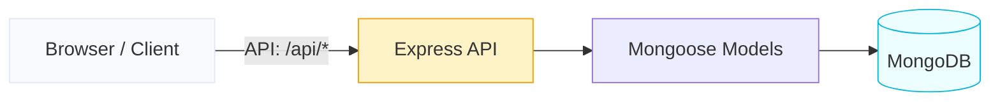

<!-- Advanced README: developer-focused with architecture and operational details -->
# Pantry Pro — Grocery Pro OS

Pantry Pro is a prototype web application demonstrating a modern grocery & pantry management UX. It pairs a responsive React + Vite frontend with a lightweight Express API and a MongoDB backend. The goal is a product-like prototype that showcases inventory health, shopping recommendations, recipes, household sync, and secure user flows.

---

## Table of contents

- Project summary
- Features
- Architecture
- Folder structure
- Local development
- Environment variables
- API reference
- Demo & data seeding
- Testing and quality
- Production recommendations
- Contributing
- License

---

## Project summary

This repository is organized as a two-part app:

- `client/` — Vite + React SPA (Tailwind CSS, Framer Motion, Recharts)
- `server/` — Express API (Mongoose models, JWT auth, controllers)

It is intended for prototyping and demos; security and scaling recommendations are listed below for production readiness.

## Features

- Household-focused dashboard and pantry boards
- Consumption analytics and visualizations
- Recipes and meal suggestions based on pantry stock
- JWT-based authentication with register/login/profile flows
- Demo seed data to populate UI quickly for presentation

## Architecture (high level)

Client and server communicate over HTTPS (during production). The server authenticates requests using Bearer JWTs and uses Mongoose to persist data in MongoDB.



## Folder structure (short)

- `client/`
	- `src/components/` — UI primitives & layout
	- `src/pages/` — page routes (Landing, Home, Recipes, Settings, etc.)
	- `src/context/` — `AuthContext`, `ThemeContext`, etc.
	- `src/data/` — demo content used by the UI

- `server/`
	- `models/` — `User`, `Transaction`
	- `controllers/` — business logic for auth and transactions
	- `routes/` — route mounting files
	- `middleware/` — `authMiddleware` (JWT verification)

## Local development

Prerequisites:

- Node.js 18+ (tested with Node 20)
- MongoDB (local daemon or Atlas cluster)

Install all dependencies:

```bash
npm --prefix ./server install
npm --prefix ./client install
```

Run server and client for development (hot reload):

```bash
# in separate terminals
npm --prefix ./server run dev
npm --prefix ./client run dev
```

Build the frontend for production:

```bash
npm --prefix ./client run build
```

## Environment variables

Create `server/.env` with at least:

```
MONGO_URI=mongodb://127.0.0.1:27017/pantrypro
JWT_SECRET=replace_with_a_strong_secret
PORT=5000
```

Do not commit `.env` to source control. For CI/CD set variables in the pipeline or platform secrets.

## API reference

Auth endpoints (see `server/routes/authRoutes.js`):

- `POST /api/auth/register`
	- Request: `{ name, email, password }`
	- Response: `{ token, user }` (user excludes password hash)

- `POST /api/auth/login`
	- Request: `{ email, password }`
	- Response: `{ token, user }`

- `PUT /api/auth/me` (protected)
	- Request: partial user fields (e.g., `{ name, password }`)
	- Response: updated `{ token, user }`

Transactions (protected; example):

- `GET /api/transactions`
- `POST /api/transactions`
- `PUT /api/transactions/:id`
- `DELETE /api/transactions/:id`

All protected endpoints require `Authorization: Bearer <token>`.

## Demo & data seeding

The client ships with demo content in `client/src/data/groceryData.js` for immediate visual richness. If you want the server DB to contain demo documents, add a script `server/scripts/seedDemo.js` that connects to MongoDB and inserts sample `User` and `Transaction` documents. I can generate that script if you'd like.

## Testing & quality

- Linting (client):

```bash
npm --prefix ./client run lint
```

- There are no automated tests in this prototype. Recommended additions:
	- Unit tests for utility functions and React hooks (Vitest or Jest)
	- Integration tests for Express routes (`supertest`)

## Production recommendations

- Secure secrets: use platform-managed secrets or environment variables, never commit `.env`.
- Use httpOnly secure cookies for tokens with CSRF protection, or rotate JWTs and implement refresh tokens.
- Add input validation (e.g., `zod`/`joi`) and rate limiting (`express-rate-limit`).
- Add observability: structured logs, monitoring, error reporting.
- Run the API behind a load balancer and serve static client assets from a CDN.

## Contributing

1. Fork and branch from `main`.
2. Run the app locally and implement changes.
3. Keep commits focused; include tests for new logic.
4. Open a PR describing user-visible changes and implementation notes.

Developer notes:

- When adding new APIs, update `client/src/api/transactionApi.js` to include the endpoint and ensure the axios instance attaches the `Authorization` header.

## License

This repository is licensed under the MIT License — see `LICENSE`.

---

If you want follow-ups I can:

- Add a `server/scripts/seedDemo.js` file and run it to populate MongoDB with sample users & transactions.
- Create a minimal GitHub Actions workflow that runs lint/build on push.
- Commit and push these changes for you.

Tell me which follow-up you'd like.
